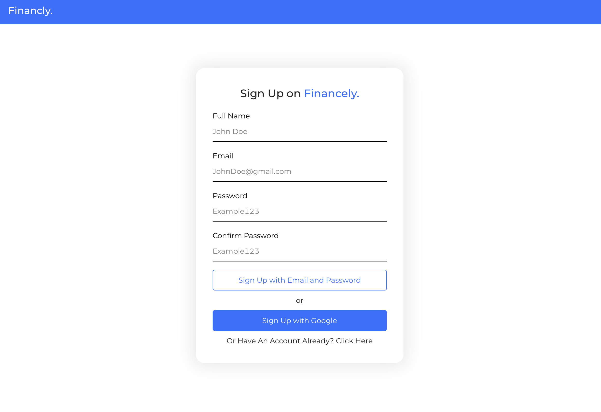
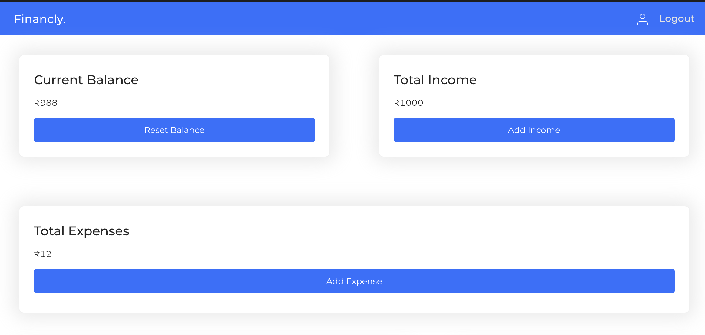
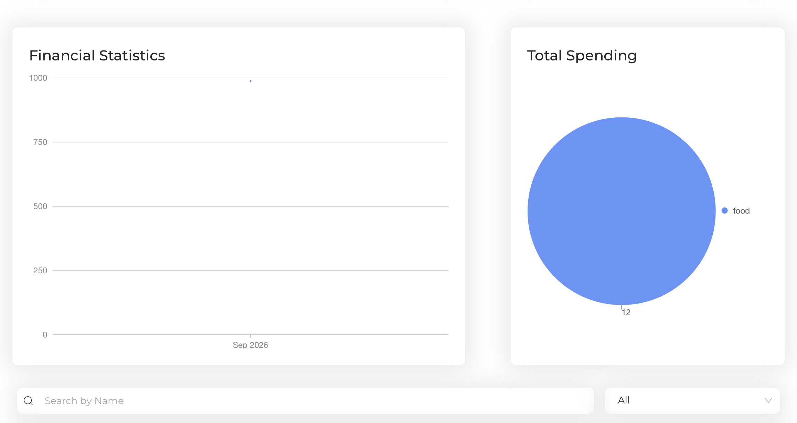
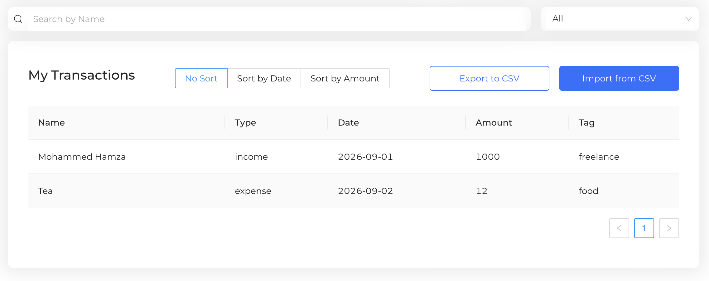

# 💰 Finance Tracker

A React-based personal finance management application that helps users
track income, expenses, balances, and transactions in one place.

## 🚀 Live Demo

**[Open Finance
Tracker](https://mohammed-hamza-dev.github.io/finance-tracker/)**

## 📸 Screenshots

### 🔐 Authentication



### 💰 Dashboard



### 📊 Financial Analytics



### 🧾 Transaction Management



## ✨ Features

-   🔐 Email/password authentication with Firebase
-   🔵 Google authentication
-   💰 View current balance
-   💵 Add income transactions
-   💸 Add expense transactions
-   🧾 View all transactions
-   🔎 Search transactions by name
-   🏷️ Filter transactions by type
-   📅 Sort transactions by date
-   💲 Sort transactions by amount
-   📊 Monthly balance visualization
-   🥧 Spending breakdown by category
-   📥 Import transactions from CSV
-   📤 Export transactions to CSV
-   ☁️ Store user transactions in Firebase Firestore
-   🔔 Toast notifications for important actions

## 🛠️ Tech Stack

| Technology | Purpose |
|------------|---------|
| React.js | Frontend application |
| JavaScript | Application logic |
| HTML5 | Page structure |
| CSS3 | Styling |
| Firebase Authentication | User authentication |
| Firebase Firestore | Transaction data storage |
| Ant Design | UI components |
| Ant Design Charts | Financial charts |
| React Router | Application routing |
| PapaParse | CSV import/export |
| React Toastify | User notifications |
| Git & GitHub | Version control and deployment |
| GitHub Pages | Application deployment |

## 📊 Dashboard

The dashboard provides an overview of:

-   Current balance
-   Total income
-   Total expenses
-   Monthly financial balance
-   Spending by transaction category
-   Complete transaction history

## 🔎 Transaction Management

Users can search, filter, and sort their transactions.

Supported transaction operations include:

-   Search by transaction name
-   Filter by income or expense
-   Sort by date
-   Sort by amount
-   Import transactions from a CSV file
-   Export transactions to a CSV file

## ☁️ Firebase Integration

The application uses Firebase for authentication and cloud data storage.

Each authenticated user's transactions are stored in Firestore under
their user account, allowing the application to retrieve the user's
financial records after login.

## 📂 Project Structure

``` text
finance-tracker/
│
├── public/
│
├── src/
│   ├── assets/
│   ├── components/
│   │   ├── Header/
│   │   ├── Loader/
│   │   └── Modals/
│   │
│   │   ├── Cards.js
│   │   ├── Dashboard.js
│   │   ├── NoTransactions.js
│   │   ├── Signup.js
│   │   └── TransactionSearch.js
│   │
│   ├── App.js
│   ├── App.css
│   ├── firebase.js
│   ├── index.css
│   ├── styles.css
│   └── index.js
│
├── package.json
├── package-lock.json
└── README.md
```

## ⚙️ Getting Started

### Prerequisites

Make sure you have the following installed:

-   Node.js
-   npm
-   Git

### Installation

Clone the repository:

``` bash
git clone https://github.com/mohammed-hamza-dev/finance-tracker.git
```

Move into the project directory:

``` bash
cd finance-tracker
```

Install the dependencies:

``` bash
npm install
```

Start the development server:

``` bash
npm start
```

The application will be available at:

``` text
http://localhost:3000
```

## 🏗️ Build for Production

Create an optimized production build:

``` bash
npm run build
```

## 🌐 Deployment

This project is deployed using GitHub Pages.

The deployment script uses:

``` bash
npm run deploy
```

The production build is generated and published to GitHub Pages.

## 🎯 Project Purpose

This project was developed to practice and demonstrate practical
frontend development skills with React, JavaScript, Firebase, data
visualization, and transaction management.

It combines authentication, cloud data storage, financial calculations,
charts, CSV processing, and a responsive user interface into a single
application.

## 👨‍💻 Author

**Mohammed Hamza**

-   GitHub: [mohammed-hamza-dev](https://github.com/mohammed-hamza-dev)
-   LinkedIn: [Mohammed
    Hamza](https://www.linkedin.com/in/mohammed-hamza-b93700370)

## 📄 License

This project was created for learning and educational purposes.
